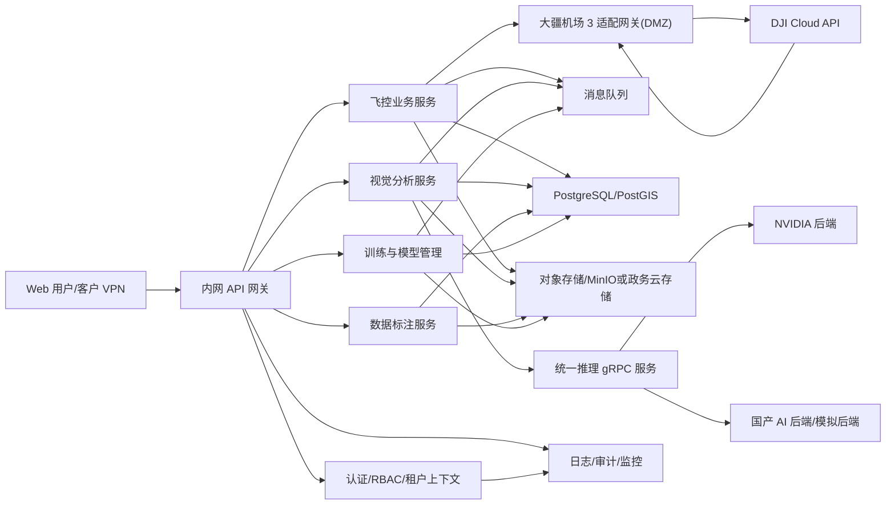
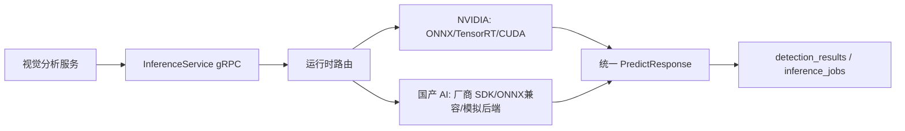

# 无人机智能巡检系统架构文档

## 1. 架构结论

系统采用逻辑多租户、分区部署、适配器集成和异步任务链路架构。一期包括四个平台边界：

- 飞控平台：任务编排、航线管理、审批、机巢控制适配、遥测监控、异常联动、媒体同步。
- 视觉分析平台：媒体入库、抽帧、异步推理、结果聚合、告警、工单、人工复核。
- 数据标注平台：样本池、标注任务、初检/复检、数据集导出。
- 训练与模型管理平台：训练、评估、模型制品、双硬件适配、灰度发布、回滚。

外部系统通过适配器接入。模拟器只能用于开发和 M1 平台闭环，不能替代生产验收。

## 2. 总体架构图



## 3. 网络分区

| 网络区 | 部署组件 | 网络权限 | 控制要求 |
| --- | --- | --- | --- |
| 互联网出口/DMZ 区 | 大疆机场 3 适配网关、证书/回调入口、必要反向代理 | 仅允许访问 DJI Cloud API 白名单域名/IP；仅开放必要回调端口 | 出站白名单、TLS、API 签名、最小端口、访问日志 |
| 内网业务区 | 飞控业务服务、任务审批、Web 后台、分析、标注、训练管理 | 不直接访问互联网；只访问 DMZ 适配网关、数据区、AI 服务区 | 服务间认证、RBAC、审计、API 网关 |
| 数据区 | PostgreSQL/PostGIS、对象存储、消息队列、模型仓库、配置中心 | 仅允许业务区、AI 服务区按最小权限访问 | 数据库账号分权、bucket 路径隔离、队列 ACL、备份 |
| AI 服务区 | 推理服务、训练服务、GPU/国产 AI 加速卡节点 | 不访问互联网；访问对象存储、模型仓库、消息队列 | 镜像白名单、模型制品校验、资源隔离 |
| 运维审计区 | 日志、监控、审计、告警、堡垒机 | 只接收日志/指标，运维访问经堡垒机 | 操作留痕、最小权限、告警策略 |
| 客户现有系统区 | 统一身份、OA/空域审批、GIS、工单平台 | 通过内网专线/API 对接 | 接口签名、IP 白名单、失败重试 |

禁止分析、标注、训练、AI 服务区直接访问互联网。依赖包、模型、镜像需离线导入或进入受控制品库。

## 4. 多租户架构

租户模型必须区分平台方租户和客户租户。

| 隔离层 | 设计 |
| --- | --- |
| 租户模型 | `tenants` 为租户根实体，支持 `PLATFORM_OPERATOR` 与 `CUSTOMER_TENANT` |
| 用户与权限 | `users`、`roles`、`user_tenant_roles`、`tenant_feature_entitlements` 共同决定访问范围 |
| 功能授权 | 客户租户默认开放飞控、标注、分析结果、告警/工单；训练、发布、跨租户统计默认关闭 |
| 数据授权 | 客户数据用于平台方训练、评估或统计前，必须有 `tenant_data_grants` |
| 设备与航线 | 设备、机巢、航线、巡检资产归属租户 |
| 媒体与对象 | 对象路径按 `tenant_id/project_id/mission_id` 分层 |
| 消息队列 | 消息体必须包含 `tenant_id`，消费者必须校验租户 |
| 审计日志 | 成功、失败、越权、跨租户拒绝和管理员切换租户均写审计 |

一期支持 L1 逻辑隔离，不承诺每租户物理隔离。

## 5. 外部系统适配

| 外部能力 | 开发模拟 | 生产要求 |
| --- | --- | --- |
| 统一身份 | 本地账号 | LDAP/CAS/OAuth2/OIDC 之一，或形成书面豁免 |
| OA/空域审批 | 内置审批流模拟器 | 优先接 OA/空域审批；无接口时需客户确认人工流程 |
| GIS 路网/资产 | 最小资产台账 | 明确资产来源、坐标系和更新频率 |
| 对象存储 | MinIO | 客户认可的内网对象存储或 S3 兼容存储 |
| 工单平台 | 内置 `work_orders` | 若客户已有平台，生产需对接或确认替代 |
| 大疆机场 3 / DJI Cloud API | 大疆机场 3 适配层模拟器 | 真实设备、真实凭证、仅适配网关访问 DJI Cloud API |

## 6. 大疆机场 3 适配层

适配层能力包括设备绑定、设备状态同步、航线上传、任务下发、任务控制、遥测订阅、媒体同步和异常事件。

所有回调落库前必须转换为：

```json
{
  "event_code": "telemetry",
  "event_time": "2026-06-16T09:20:01Z",
  "device_sn": "1581F6Q8D24CA00G123",
  "raw_payload": {}
}
```

外层字段 `event_code`、`event_time`、`device_sn`、`raw_payload` 不得变更。`raw_payload` 可随 DJI Cloud API 版本调整。

## 7. 推理运行时架构



统一约束：
- 对分析平台只暴露 gRPC `Predict`。
- 每个模型版本记录原始模型、ONNX、后端制品、运行时镜像、驱动、设备型号和 digest。
- 国产卡型号未锁定前只能做接口契约和模拟后端验收。
- 同模型、同输入、不同后端的输出差异超过阈值时阻断发布。

## 8. 状态机

### 8.1 飞行任务状态

| 状态 | 说明 |
| --- | --- |
| DRAFT | 草稿可编辑，不触发设备侧动作 |
| PENDING_APPROVAL | 等待 OA/空域审批 |
| APPROVED | 审批通过但未下发 |
| DISPATCHING | 正在调用 DJI 适配层 |
| DISPATCHED | 设备侧已接受任务 |
| EXECUTING | 飞行执行中 |
| PAUSED | 人工暂停或设备侧暂停 |
| RETURNING | 返航或人工接管中 |
| LOST_LINK | 通信中断，平台等待设备侧回执 |
| COMPLETED | 飞行完成，可有媒体回传 |
| ABORTED | 异常终止，仍可能存在部分媒体 |
| MEDIA_SYNCING | 媒体同步中 |
| PARTIAL_MEDIA_READY | 部分媒体可分析 |
| MEDIA_READY | 全量媒体可分析 |
| ANALYSIS_READY | 可提交分析任务 |
| CANCELLED | 未执行前取消 |
| REJECTED | 审批驳回 |
| EXPIRED | 审批或计划时间过期 |
| DISPATCH_FAILED | 任务下发失败，可重试 |
| SYNC_FAILED | 媒体同步失败，可重试或归档 |
| ARCHIVED | 任务关闭或归档 |

### 8.2 其他核心状态

| 对象 | 状态 |
| --- | --- |
| media_files / frame_assets | CAPTURED, UPLOADING, UPLOAD_FAILED, REGISTERING, READY, REJECTED, FRAME_EXTRACTING, FRAME_READY, ARCHIVED, DELETED |
| analysis_task | CREATED, QUEUED, RUNNING, WAITING_RESOURCE, PARTIAL_SUCCESS, FAILED, COMPLETED, CANCELLED |
| inference_job | QUEUED, RUNNING, RETRYING, FAILED, SUCCEEDED, TIMEOUT |
| event | CANDIDATE, NEEDS_REVIEW, NEEDS_GEO_REVIEW, CONFIRMED, REJECTED, DISPATCHED, CLOSED |
| annotation_task | CREATED, ASSIGNED, ANNOTATING, SUBMITTED, REVIEWING, RETURNED, PASSED, FINAL_PASSED, CANCELLED |
| dataset | DRAFT, BUILDING, FROZEN, DEPRECATED, ARCHIVED |
| training_job | CREATED, QUEUED, RUNNING, EVALUATING, FAILED, SUCCEEDED, CANCELLED |
| model_version | CREATED, CONVERTING, VALIDATING, READY, BLOCKED, DEPRECATED |
| algorithm_release | DRAFT, PENDING_APPROVAL, GRAY, ACTIVE, ROLLED_BACK, RETIRED |

## 9. 核心数据模型

| 领域 | 实体 |
| --- | --- |
| 租户与权限 | tenants, users, roles, user_tenant_roles, tenant_feature_entitlements, tenant_data_grants, audit_logs |
| 设备与资产 | devices, docks, road_assets, bridge_assets, slope_assets, coordinate_transforms |
| 飞控 | routes, route_versions, missions, mission_approvals, flight_events |
| 媒体 | media_files, media_chunks, frame_assets |
| 算法与推理 | algorithms, algorithm_label_schemas, algorithm_thresholds, analysis_tasks, analysis_task_algorithms, inference_jobs, detection_results |
| 事件与工单 | events, event_asset_links, review_records, feedback_samples, work_orders |
| 标注 | annotation_tasks, annotation_task_samples, annotations |
| 训练与发布 | datasets, training_jobs, model_versions, runtime_artifacts, algorithm_releases |

租户根业务表必须显式包含 `tenant_id`；子表可以继承父表租户，但查询和写入时必须校验父子租户一致。

## 10. GIS 定位架构

检测结果先保留图像像素坐标和帧时间，再结合无人机遥测、航线、相机姿态、GIS 资产几何进行空间映射。

| 等级 | 名称 | 一期要求 |
| --- | --- | --- |
| L0 | 图像证据级 | 用于算法调试和人工复核，不作为正式工单定位 |
| L1 | 资产级 | 一期最低生产验收目标 |
| L2 | 桩号/区段级 | 一期优先目标；GIS 数据不足时进入人工复核 |
| L3 | 构件/精确空间级 | 二三期目标，一期不承诺自动达到 |

无法可靠定位到资产时，事件进入 `NEEDS_GEO_REVIEW`，由人工修正后再生成正式工单。

## 11. 架构验收清单

- 系统名称、平台方、客户租户类型固定，待确认项未被误写为已锁定。
- 每个一期算法可映射到算法主数据、标注类型、模型类型、输出字段、阈值策略、验收目标和样本基线。
- 多租户隔离具备数据模型、权限模型、对象路径、消息、审计和验收用例。
- 训练/发布默认仅平台方可用，客户租户访问未授权能力返回 `FEATURE_403`。
- 客户租户数据用于平台方训练前必须有 `tenant_data_grants`。
- 仅大疆机场 3 适配网关可访问互联网和 DJI Cloud API。
- 飞控平台不承诺自研底层飞控，所有设备执行结果以 DJI 回执为准。
- 训练与推理对上层暴露统一接口，对下层保留 NVIDIA 与国产 AI 加速卡适配空间。
- 媒体生命周期从采集、上传、入库、抽帧、分析、标注回流到归档清理均有状态定义。
- U0-U7 有依赖输入、交付输出、完成定义和对应测试文档。
